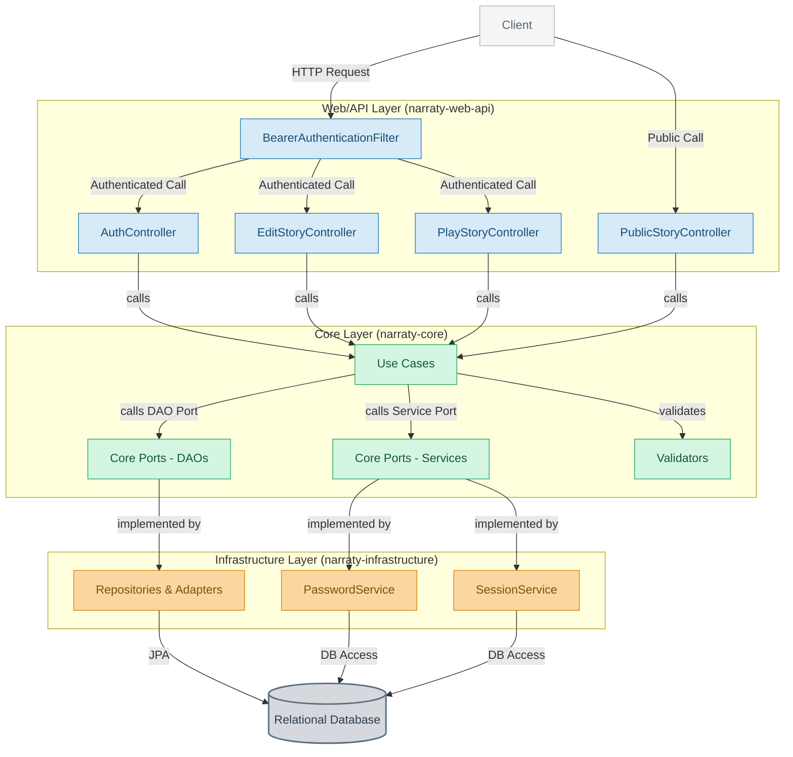

# Le livre dont vous êtes le héros

```mermaid
---
config:
  layout: dagre
---
flowchart TD
    subgraph subGraph0["Web/API Layer (narraty-web-api)"]
        direction TB
        AuthFilter["BearerAuthenticationFilter"]
        AuthController["AuthController"]
        EditStoryController["EditStoryController"]
        PlayStoryController["PlayStoryController"]
        PublicStoryController["PublicStoryController"]
    end
    subgraph subGraph1["Core Layer (narraty-core)"]
        direction TB
        PortsDAOs["Core Ports - DAOs"]
        PortsServices["Core Ports - Services"]
        UseCases["Use Cases"]
        Validators["Validators"]
    end
    subgraph subGraph2["Infrastructure Layer (narraty-infrastructure)"]
        direction TB
        ReposAdapters["Repositories & Adapters"]
        PasswordService["PasswordService"]
        SessionService["SessionService"]
    end
    User["Client"] -- HTTP Request --> AuthFilter
    AuthFilter -- Authenticated Call --> AuthController & EditStoryController & PlayStoryController
    User -- Public Call --> PublicStoryController
    AuthController -- calls --> UseCases
    EditStoryController -- calls --> UseCases
    PlayStoryController -- calls --> UseCases
    PublicStoryController -- calls --> UseCases
    UseCases -- validates --> Validators
    UseCases -- calls DAO Port --> PortsDAOs
    UseCases -- calls Service Port --> PortsServices
    PortsDAOs -- implemented by --> ReposAdapters
    PortsServices -- implemented by --> PasswordService & SessionService
    ReposAdapters -- JPA --> Database[("Relational Database")]
    PasswordService -- DB Access --> Database
    SessionService -- DB Access --> Database
    AuthFilter:::web
    AuthController:::web
    EditStoryController:::web
    PlayStoryController:::web
    PublicStoryController:::web
    PortsDAOs:::core
    PortsServices:::core
    UseCases:::core
    Validators:::core
    ReposAdapters:::infra
    PasswordService:::infra
    SessionService:::infra
    User:::external
    Database:::db
    classDef web fill:#D6EAF8,stroke:#2980B9,color:#1B4F72
    classDef core fill:#D5F5E3,stroke:#27AE60,color:#145A32
    classDef infra fill:#FAD7A0,stroke:#D68910,color:#7E5109
    classDef external fill:#F5F5F5,stroke:#AAB7B8,color:#566573
    classDef db fill:#D5D8DC,stroke:#5D6D7E,color:#2C3E50,stroke-width:2px,shape:cylinder
    click AuthFilter "https://github.com/tomfregonese/le-livre-dont-vous-etes-le-heros/blob/main/narraty-web-api/src/main/java/com/ynov/javaformation/narraty/middlewares/BearerAuthenticationFilter.java"
    click AuthController "https://github.com/tomfregonese/le-livre-dont-vous-etes-le-heros/blob/main/narraty-web-api/src/main/java/com/ynov/javaformation/narraty/controllers/AuthController.java"
    click EditStoryController "https://github.com/tomfregonese/le-livre-dont-vous-etes-le-heros/blob/main/narraty-web-api/src/main/java/com/ynov/javaformation/narraty/controllers/EditStoryController.java"
    click PlayStoryController "https://github.com/tomfregonese/le-livre-dont-vous-etes-le-heros/blob/main/narraty-web-api/src/main/java/com/ynov/javaformation/narraty/controllers/PlayStoryController.java"
    click PublicStoryController "https://github.com/tomfregonese/le-livre-dont-vous-etes-le-heros/blob/main/narraty-web-api/src/main/java/com/ynov/javaformation/narraty/controllers/PublicStoryController.java"
    click PortsDAOs "https://github.com/tomfregonese/le-livre-dont-vous-etes-le-heros/tree/main/narraty-core/src/main/java/com/ynov/javaformation/narraty/interfaces/daos/"
    click PortsServices "https://github.com/tomfregonese/le-livre-dont-vous-etes-le-heros/tree/main/narraty-core/src/main/java/com/ynov/javaformation/narraty/interfaces/services/"
    click UseCases "https://github.com/tomfregonese/le-livre-dont-vous-etes-le-heros/tree/main/narraty-core/src/main/java/com/ynov/javaformation/narraty/usecase/"
    click Validators "https://github.com/tomfregonese/le-livre-dont-vous-etes-le-heros/tree/main/narraty-core/src/main/java/com/ynov/javaformation/narraty/validators/"
    click ReposAdapters "https://github.com/tomfregonese/le-livre-dont-vous-etes-le-heros/tree/main/narraty-infrastructure/src/main/java/com/ynov/javaformation/narraty/data/repositories/"
    click PasswordService "https://github.com/tomfregonese/le-livre-dont-vous-etes-le-heros/blob/main/narraty-infrastructure/src/main/java/com/ynov/javaformation/narraty/services/PasswordService.java"
    click SessionService "https://github.com/tomfregonese/le-livre-dont-vous-etes-le-heros/blob/main/narraty-infrastructure/src/main/java/com/ynov/javaformation/narraty/services/SessionService.java"
```